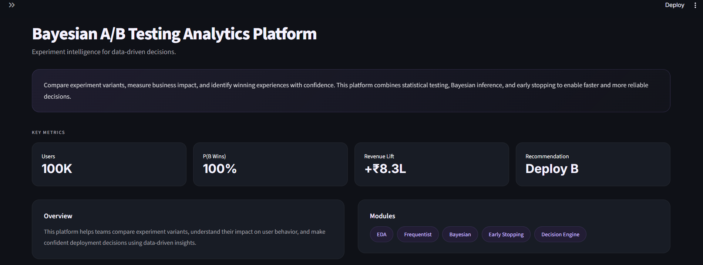
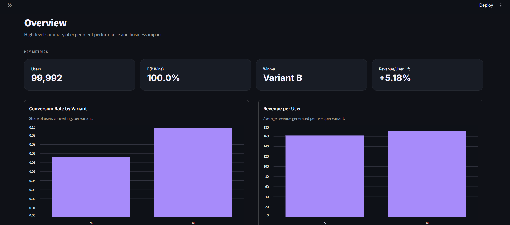
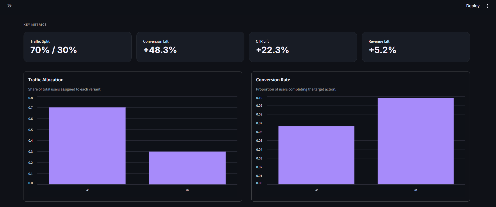
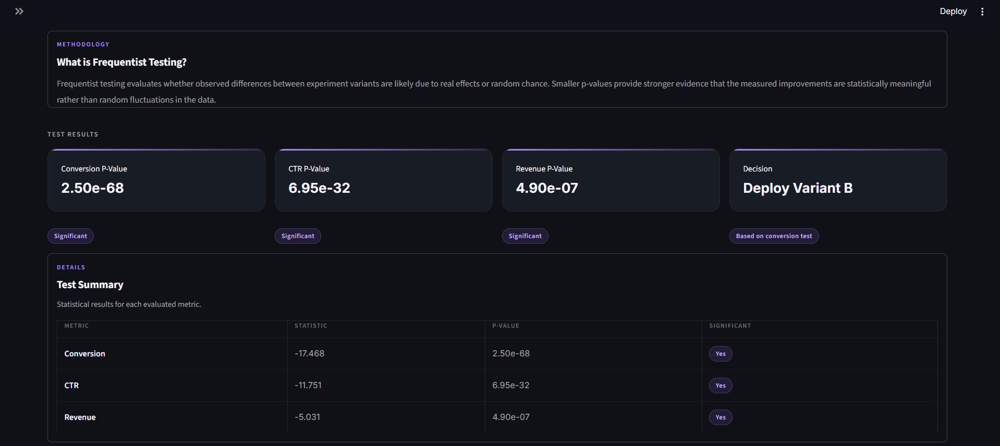
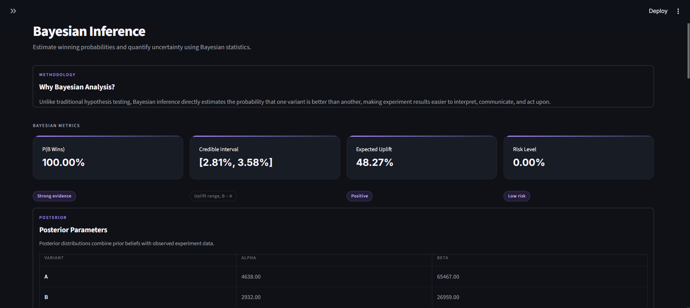
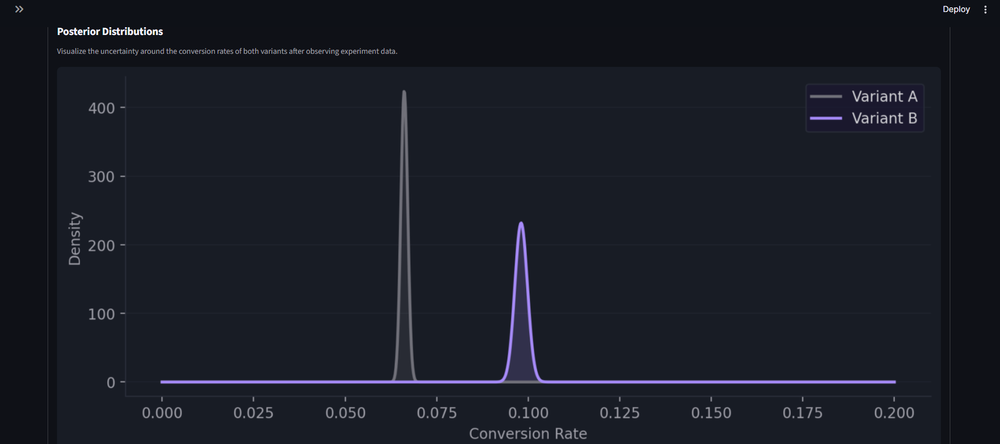
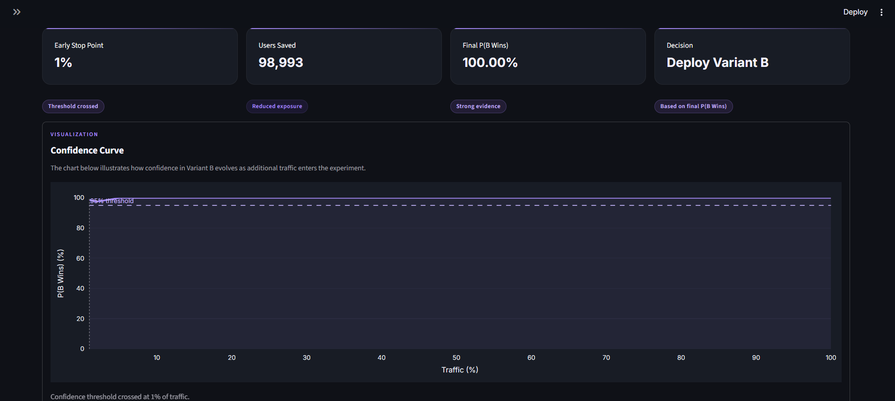
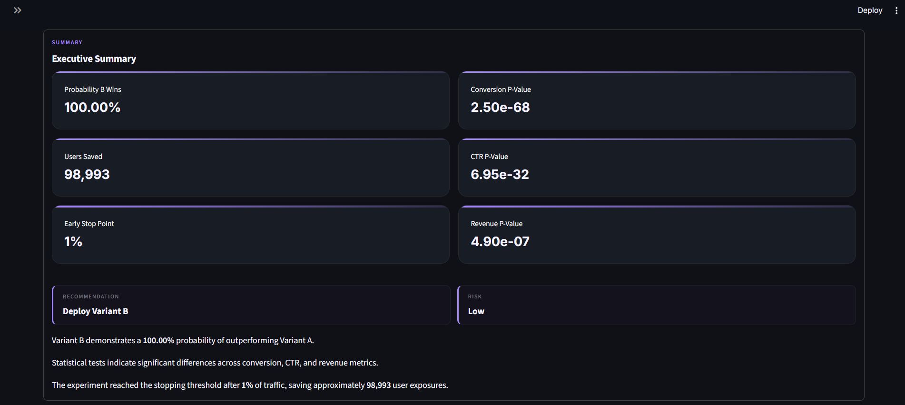

# Bayesian A/B Testing Analytics Platform

An end-to-end experimentation platform for simulating, analyzing, and evaluating A/B tests — using both Frequentist and Bayesian approaches, because honestly, one method alone never tells the whole story.

It starts from raw experiment generation and walks all the way through to deployment recommendations, all wrapped in an interactive Streamlit dashboard.

---

## Live Demo

🔗 [live](https://bayesian-ab-testing-platform.streamlit.app/)

## Why I Built This

A/B testing shows up everywhere in product work, but most tutorials stop the second you get a p-value. Test significant? Great, ship it. Done.

That always felt incomplete to me. So I tried to build the whole lifecycle instead:

* Generate realistic experiment data
* Analyze user behavior
* Run the statistical tests
* Estimate Bayesian probabilities
* Figure out when it's safe to stop early
* Turn all of that into an actual business decision

I wasn't just trying to learn how A/B tests work — I wanted to understand how companies actually use them to decide what to ship.

---

## Project Workflow

```text
Raw Data
   ↓
EDA
   ↓
Frequentist Testing
   ↓
Bayesian Inference
   ↓
Early Stopping
   ↓
Decision Engine
```

---

## Dataset

The base data comes from the [Olist Brazilian E-Commerce dataset on Kaggle](https://www.kaggle.com/datasets/olistbr/brazilian-ecommerce) — real orders, customers, and transactions from a Brazilian marketplace. I used that as the foundation and simulated an A/B experiment layer on top of it, so the result feels like a real online experiment rather than a toy example. Each user record includes:

* Variant assignment (A or B)
* Conversion outcome
* Click-through behavior
* Revenue generated
* Device type
* Customer segment

That gives enough texture to analyze things at the whole-experiment level and zoom into individual user segments when something interesting shows up.

---

## Project Structure

```text
bayesian_ab_testing_platform/
│
├── dashboard/
│   ├── app.py
│   └── pages/
│       ├── 1_Overview.py
│       ├── 2_EDA.py
│       ├── 3_Frequentist.py
│       ├── 4_Bayesian.py
│       ├── 5_Early_Stopping.py
│       └── 6_Decision_Engine.py
│
├── src/
│   ├── bayesian.py
│   ├── decision_engine.py
│   ├── early_stopping.py
│   ├── eda.py
│   ├── frequentist.py
│   └── utils.py
│
├── data/
│   └── experiments/
│       └── ab_experiment_dataset.csv
│
├── notebooks/
└── README.md
```

---

## Notebooks

I didn't write this as clean modules from day one — it grew out of a string of notebooks that I later refactored into something reusable.

### `01_build_base_dataset.ipynb`
Pulled in the Olist dataset from Kaggle and shaped it into the base experimental dataset.

### `02_experiment_simulation.ipynb`
Simulated realistic user behavior for conversions, clicks, revenue, device usage, and customer segments.

### `03_experiment_eda.ipynb`
Explored the data and sanity-checked that the experiment actually looked the way an experiment should.

### `04_frequentist_ab_testing.ipynb`
Implemented the classical hypothesis testing toolkit — two-proportion Z-tests, T-tests, and the inevitable p-value interpretation.

### `05_bayesian_inference_engine.ipynb`
Built the Bayesian side using Beta distributions: posterior distributions, the probability that Variant B wins, and credible intervals.

### `07_bayesian_early_stopping.ipynb`
Added sequential monitoring so the experiment doesn't have to burn through all its traffic before you know the answer.

### `08_experiment_decision_engine.ipynb`
Pulled everything together — Bayesian, Frequentist, early stopping — into one set of business recommendations.

### `09_refactor_testing.ipynb`
Where I stress-tested the final package before wiring it into Streamlit.

*(Yes, there's a jump from 05 to 07 — 06 didn't survive the cut. I'm leaving the gap as an honest record of how the project actually evolved.)*

---

## Python Modules

### `eda.py`
Helper functions for conversion metrics, revenue metrics, traffic allocation, and segmentation analysis.

### `frequentist.py`
Classical statistical testing — conversion tests, CTR tests, revenue tests.

### `bayesian.py`
Bayesian inference using a Beta-Bernoulli model: posterior estimation, probability B wins, credible intervals.

### `early_stopping.py`
Sequential Bayesian monitoring — confidence curves, stopping thresholds, and how many users you'd save by not running the experiment longer than necessary.

### `decision_engine.py`
Aggregates all the statistical evidence into a plain-language call: Deploy Variant B, Continue Experiment, or Insufficient Evidence.

---

## Dashboard

The Streamlit dashboard walks through the full experimentation workflow across six pages.

### Home
A quick orientation — what this project is and what you're about to look at.



### Overview
The high-level numbers: users, winning probability, revenue lift, conversion performance.



### EDA
Digging into experiment behavior — traffic allocation, conversion rates, CTR, device analysis, customer segments, and revenue distributions.



### Frequentist Testing
The classical significance story — p-values, what's significant and what isn't, and what that actually means.



### Bayesian Inference
Posterior distributions, credible intervals, and the probability that Variant B actually wins.





### Early Stopping
How confidence evolves over time, where the stopping threshold gets crossed, and how much traffic that saves.



### Decision Engine
Where all the evidence lands — the final recommendation.



---

## Statistical Methods Used

**Frequentist**
* Two-proportion Z-test
* Independent T-test
* Hypothesis testing

**Bayesian**
* Beta-Bernoulli model
* Monte Carlo sampling
* Credible intervals

**Early Stopping**
* Sequential Bayesian monitoring
* Confidence thresholding

---

## Installation

Clone the repository:

```bash
git clone https://github.com/ShaiviSri04/bayesian-ab-testing-platform.git
cd bayesian_ab_testing_platform
```

Install dependencies:

```bash
pip install -r requirements.txt
```

Run the dashboard:

```bash
python -m streamlit run dashboard/app.py
```

---

## What I Learned

Mostly this: experimentation isn't just a statistics problem. A framework that actually holds up also needs reliable data pipelines, metrics people can interpret without a stats degree, honest uncertainty quantification, and decisions framed in terms a business actually cares about.

Along the way I also got a real feel for packaging Python code properly, turning a pile of notebooks into modules that don't fall apart when reused, and shipping an analytical app that someone other than me could actually open and use.

---


